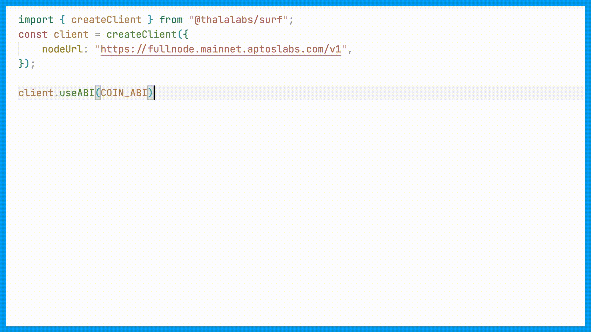

<br/>

<h1 align="center">
  Surf
</h1>

<p align="center">
  Type-Safe TypeScript Interfaces & React Hooks for Aptos.
<p>

<p align="center">
  <a href="https://www.npmjs.com/package/@thalalabs/surf">
      
  </a>
  <a href="https://github.com/ThalaLabs/surf/blob/main/LICENSE">
      
  </a>
  <a href="https://bundlephobia.com/package/@thalalabs/surf">
      
  </a>
</p>

<br>

## Features

- **No code-generation**: Interact with smart contracts using fully typed APIs based on static type inference. Inspired by [Viem](https://viem.sh/).
- **Get rid of encoding/decoding**: Surf takes care of the complexities within the APIs, so you don't have to.
- **Linting and Auto-Completion**: Enjoy a better development experience with type safety. No more guesswork for input and output.
- **Both TypeScript Interfaces & React Hooks**: Easy to use, whether working with wallets or private keys.
- **Low runtime cost & small bundle size**: [minzipped size: < 2 kB](https://bundlephobia.com/package/@thalalabs/surf).

## Overview

```TypeScript
const client = createSurfClient(new Aptos());

const result = await client.useABI(COIN_ABI).entry.transfer({
  functionArguments: ['0x1', 1],
  typeArguments: ['0x1::aptos_coin::AptosCoin'],
  account: Account.fromPrivateKey(...),
});

const [balance] = await client.useABI(COIN_ABI).view.balance({
  functionArguments: ['0x1'],
  typeArguments: ['0x1::aptos_coin::AptosCoin'],
});
```

When you input `client.useABI(COIN_ABI).view.` into your IDE, the auto-completion show as below. You could also see the input and output types for the function, all of which are statically inferred from the ABI.



## Quick Start

### Installation

```shell
npm i @thalalabs/surf @aptos-labs/ts-sdk
```

If you want to use the React Hooks, install the `@aptos-labs/wallet-adapter-react` additionally. Those React Hooks will be moved to a separate package in near future.

### Start

Create the client:

```TypeScript
import { createSurfClient } from '@thalalabs/surf';
import { Aptos, Network, AptosConfig } from '@aptos-labs/ts-sdk';

const client = createSurfClient(new Aptos(
  new AptosConfig({ network: Network.TESTNET })
));
```

Surf infers types from ABI to give you the end-to-end type-safety from your Move contract to your frontend. So firstly, you need to prepare the ABI json object of your contract in TypeScript (You can get ABI from Aptos Explorer, for example: [0x1::coin](https://explorer.aptoslabs.com/account/0x1/modules/code/coin?network=testnet)):

```TypeScript
const abi = {…} as const;
```

If type inference isn't working, it's likely you forgot to add the const assertion for the object. And make sure that you set `strict` to `true` in your `tsconfig.json` compiler options.

### Call View functions

There are two ways to call a view function with the client:

```typescript
// Option 1. Use the `useABI` interface
const [balance] = await client.useABI(COIN_ABI).view.balance({
  functionArguments: ['0x1'],
  typeArguments: ['0x1::aptos_coin::AptosCoin'],
  ledgerVersion: '562606728', // ledger_version is optional
});

// Option 2. Create payload and use the `view` interface
import { createViewPayload } from '@thalalabs/surf';
const payload = createViewPayload(COIN_ABI, {
  function: 'balance',
  functionArguments: ['0x1'],
  typeArguments: ['0x1::aptos_coin::AptosCoin'],
  // (optional) you can also override the address in ABI
  // address: "0x123"
});
const [balance] = await client.view({
  payload,
  options: { ledgerVersion: '562606728' }, // ledger_version is optional
});
```

Both of the interfaces can provide type safety.

Calling `useABI` returns an object without any ABI parsing, so that the runtime cost is low.

### Submit Transaction

Similar to the `view` function, there are also two ways to submit transactions.

```typescript
// prepare your AptosAccount
const account = /* your AptosAccount */;

// Option 1. Use the `useABI` interface
const { hash } = await client.useABI(COIN_ABI).entry.transfer({
    functionArguments: ['0x1', 1],
    typeArguments: ['0x1::aptos_coin::AptosCoin'],
    account,
});

// Option 2. Create payload and use the `submitTransaction` interface
import { createEntryPayload } from "@thalalabs/surf";
const payload = createEntryPayload(COIN_ABI, {
  function: 'transfer',
  functionArguments: ['0x1', 1],
  typeArguments: ['0x1::aptos_coin::AptosCoin'],
  // (optional) you can also override the address in ABI
  // address: "0x123"
});
const result = await client.submitTransaction({
  payload,
  signer: account,
});
```

You can also simulate a transaction:

```typescript
// prepare your AptosAccount
const account = /* your AptosAccount */;

// Option 1. Use the `useABI` interface
const { hash } = await client.useABI(COIN_ABI).entry.transfer({
    arguments: ['0x1', 1],
    type_arguments: ['0x1::aptos_coin::AptosCoin'],
    account,
    isSimulation: true,
});

// Option 2. Create payload and use the `simulateTransaction` interface
import { createEntryPayload } from "@thalalabs/surf";
const entryPayload = createEntryPayload(COIN_ABI, {
    function: 'transfer',
    arguments: ['0x1', 1],
    type_arguments: ['0x1::aptos_coin::AptosCoin'],
});

const { hash } = await client.simulateTransaction({
  payload,
  sender: account.accountAddress,
  publicKey: account.publicKey,
});
```

### Get account resource

To get account resource with type safety:

```typescript
const { data } = await client.useABI(COIN_ABI).resource.CoinStore({
  typeArguments: ['0x1::aptos_coin::AptosCoin'],
  account: '0x1',
});

// Get property in the struct with type safety
console.log(data.frozen);

// It also works for nested struct type.
// The `coin` property's type is 0x1::coin::Coin<T0>
console.log(data.coin.value);
```

Some fields of a stuct may reference external modules.To inference the type of a nested struct, it needs the ABI of the external module. Surf currently only built-in some of the ABIs from 0x1, so that it can inference types like `0x1::coin::Coin`. The type of an unidentifiable field would be `object`. Developer can provide additional modules to Surf like this:

```TypeScript
import { DefaultABITable } from "@thalalabs/surf";
import { createSurfClient } from '@thalalabs/surf';
import { Aptos } from '@aptos-labs/ts-sdk';

type ABITAble = [
  ...DefaultABITable,
  ...[
    typeof FIXED_POINT64_ABI
  ]
];

const client = createSurfClient<ABITAble>(new Aptos());
```

With this customized `ABITAble`, Surf can inference the struct from `0x4dcae85fc5559071906cd5c76b7420fcbb4b0a92f00ab40ffc394aadbbff5ee9::fixed_point64`.

Considering the `ABITable` is only been used as a type, it would be stripped out after compiling. So it won't increase the bundle size. You can put the `ABITable` in a separate file and `import type { ABITable } from "./ABITable.ts"` to ensure that.

### React Hooks

Surf currently offers two React Hooks: `useWalletClient` and `useSubmitTransaction`. Both require the `@aptos-labs/wallet-adapter-react`. Check out the [example NextJS package](https://github.com/ThalaLabs/surf/blob/main/example/app/page.tsx) for more information.

### Special types

Surf support some special types like `0x1::object::Object`, `0x1::option::Option`. Aptos has specific rule for these types. For example, Aptos accepts hex strings as input for `0x1::object::Object` argument type.

## Design details

Learning more backgrounds and design details from this [blog post](https://thalalabs.medium.com/introducing-surf-type-safe-typescript-interfaces-react-hooks-for-aptos-39527f41bc39).

## TODOs

Compared to [Viem](https://viem.sh/), Surf is still in its infancy. Any contribution is welcome and appreciated. Here are some TODOs:

- [ ] Deploy a dedicated smart contract on the testnet for Surf to run tests that cover all data types. Currently, Surf has some tests running in CI, but they do not cover all types.
- [ ] Support `struct` types for return values for `view` function.
- [ ] Accept `Uint8Array` and `string` for `vector<u8>` input. Currently users can pass these values to `createEntryPayload`, and Surf will correctly encode it. But the type system will complain. So users need to use `as any` to pass `Uint8Array` or `string` for `vector<u8>`. The type system only accept `number[]` for `vector<u8>` now.
- [ ] Add the functionality available in AptosClient to Surf, such as `estimateGasPrice`.

## License

Released under [MIT](/LICENSE) by [@ThalaLabs](https://github.com/ThalaLabs).
