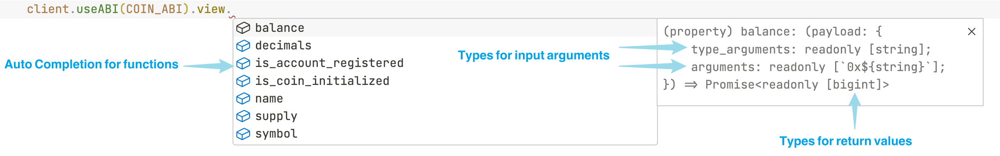

# Surf

**Surf** provides TypeScript Interfaces & React Hooks for seamlessly interacting with Aptos Smart Contracts with full type safety.

## Features

- **No code-generation**: Provide fully typed APIs based on static type inference.
- **Get rid of encoding/decoding**: We handle the complex within the APIs, so you don't have to.
- **Linting and Auto-Completion**: Enjoy a better development experience with type safety. No more guesswork for input and output.
- **Both TypeScript Interfaces & React Hooks**: Easy to use, whether working with wallets or private keys.

## Overview

```TypeScript
const client = createClient({
    nodeUrl: 'https://fullnode.testnet.aptoslabs.com/v1',
});

await client.useABI(COIN_ABI).entry.transfer({
    arguments: ['0x1', 1],
    type_arguments: ['0x1::aptos_coin::AptosCoin'],
    account,
});

const [balance] = await client.useABI(COIN_ABI).view.balance({
    arguments: ['0x1'],
    type_arguments: ['0x1::aptos_coin::AptosCoin'],
});
```

When I input `client.useABI(COIN_ABI).view.` into my IDE, the auto-completion showed as below. I could also see the input and output types for the function, all of which were statically inferred from the ABI.


## Quick Start

### Installation

```shell
npm i @thalalabs/surf aptos
```

If you want to use the React hooks, install the `@aptos-labs/wallet-adapter-react` additionally.

### Start

Create the client:

```TypeScript
import { createClient } from '@thalalabs/surf';

const client = createClient({
    nodeUrl: 'https://fullnode.testnet.aptoslabs.com/v1',
});
```

Surf infers types from ABI to give you the end-to-end type-safety from your Move contract to your frontend. So firstly, you need to prepare the ABI json object of your contract in TypeScript:

```TypeScript
const abi = {…} as const;
```

If type inference isn't working, it's likely you forgot to add the const assertion for the object. And make sure that you set `strict` to `true` in your `tsconfig.json` compiler options.

### Call View functions

There are two ways to call a view function with the client:

```typescript
// Use the `useABI` interface
const [balance] = await client.useABI(COIN_ABI).view.balance({
    arguments: ['0x1'],
    type_arguments: ['0x1::aptos_coin::AptosCoin'],
});

// Create payload and use the `view` interface
import { createViewPayload } from "@thalalabs/surf";
const viewPayload = createViewPayload(COIN_ABI, {
    function: 'balance',
    arguments: ['0x1'],
    type_arguments: ['0x1::aptos_coin::AptosCoin'],
});
const [balance] = await client.view(viewPayload);
```

Both of the interfaces can provide type safety.

### Submit transaction

Similar to the `view` function, there are also two ways to submit transactions.

```typescript
// prepare your AptosAccount
const account = /* your AptosAccount */;

// Use the `useABI` interface
const { hash } = await client.useABI(COIN_ABI).entry.transfer({
    arguments: ['0x1', 1],
    type_arguments: ['0x1::aptos_coin::AptosCoin'],
    account,
});

// Create payload and use the `submitTransaction` interface
import { createEntryPayload } from "@thalalabs/surf";
const entryPayload = createEntryPayload(COIN_ABI, {
    function: 'transfer',
    arguments: ['0x1', 1],
    type_arguments: ['0x1::aptos_coin::AptosCoin'],
});

const { hash } = await client.submitTransaction(
    entryPayload, 
    { account },
);
```

You can also simulate a transaction:

```typescript
// prepare your AptosAccount
const account = /* your AptosAccount */;

// Use the `useABI` interface
const { hash } = await client.useABI(COIN_ABI).entry.transfer({
    arguments: ['0x1', 1],
    type_arguments: ['0x1::aptos_coin::AptosCoin'],
    account,
    isSimulation: true,
});

// Create payload and use the `simulateTransaction` interface
import { createEntryPayload } from "@thalalabs/surf";
const entryPayload = createEntryPayload(COIN_ABI, {
    function: 'transfer',
    arguments: ['0x1', 1],
    type_arguments: ['0x1::aptos_coin::AptosCoin'],
});

const { hash } = await client.simulateTransaction(
    entryPayload, 
    { account }
);
```

### Hooks

- Submit Hooks
- Wallet Hooks

## Example project

WIP

## Motivation

WIP

## Contributing

WIP
